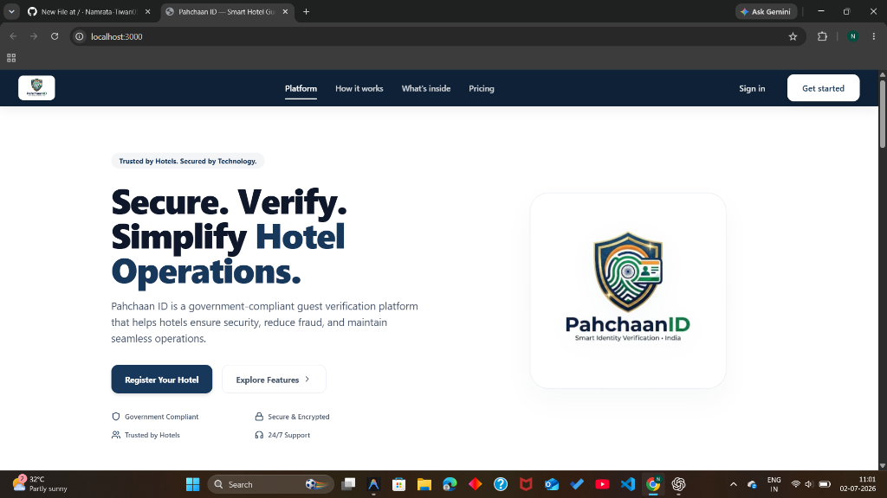
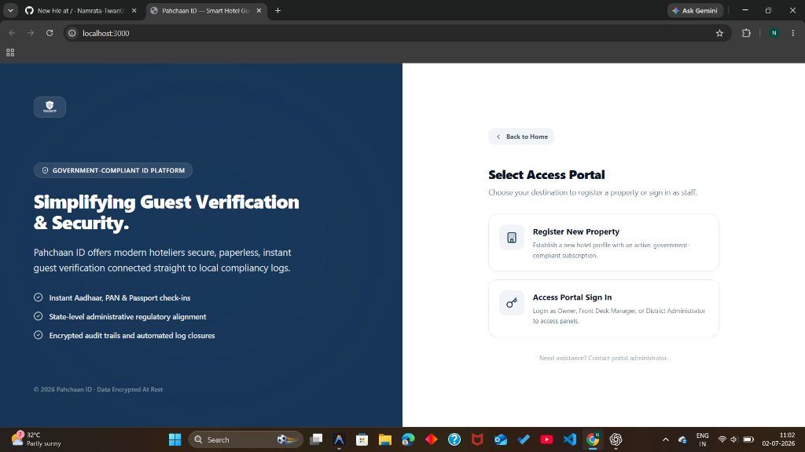
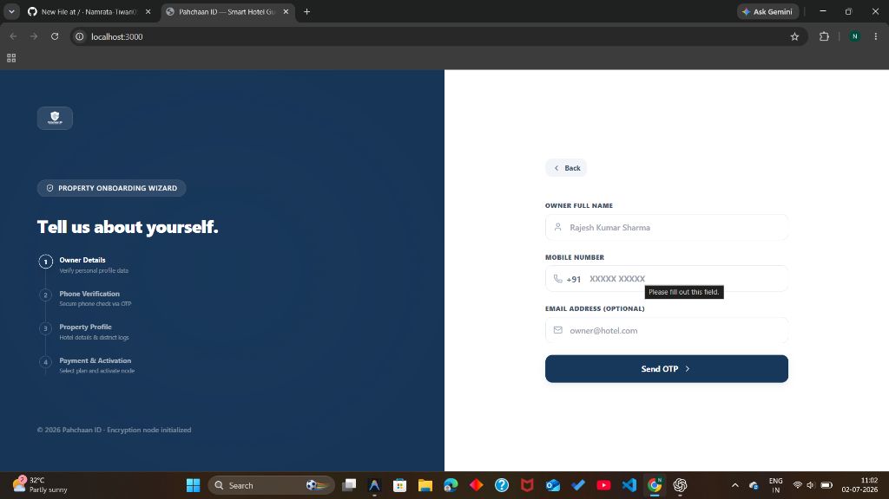
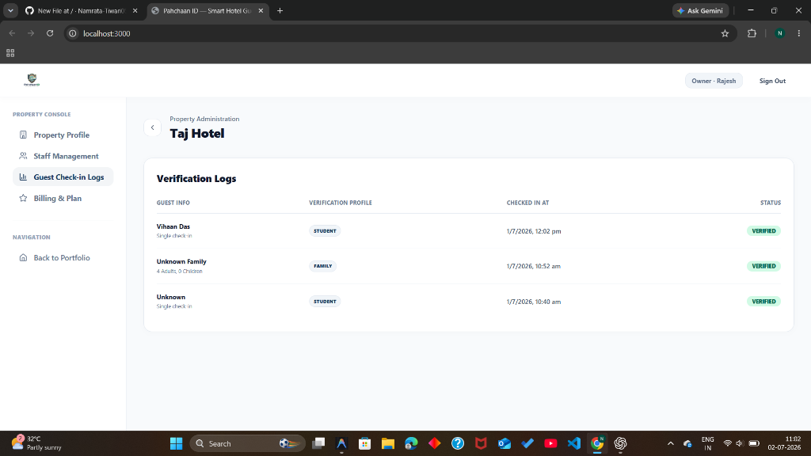
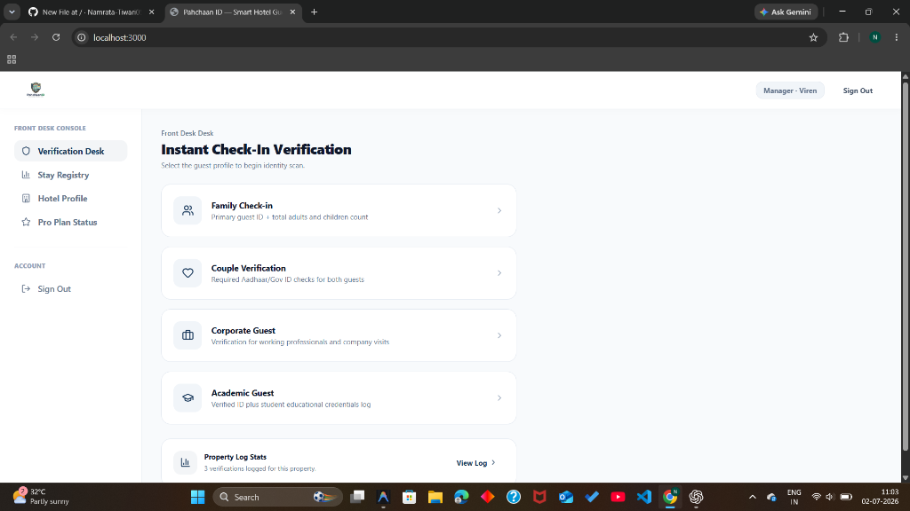

# Pahchaan ID - Smart Identity Verification & Compliance Platform

Pahchaan ID is a modern, secure, and government-compliant guest identity verification platform designed specifically for hoteliers and property managers. It enables secure, paperless, instant check-in verification connected straight to local regulatory compliancy databases.

---

## 📸 Platform Preview

Here is a preview of the main platform screens and user journeys:

### 1. Landing Page
A premium, dark-themed hero portal introducing Pahchaan ID's core value proposition and security compliance.


### 2. Access Portal Selector
A clean and intuitive gateway allowing owners to onboard new properties and staff/managers to access their respective consoles.


### 3. Property Onboarding Wizard
A step-by-step onboarding flow enabling property owners to register and activate their hotel nodes.


### 4. Property Owner Dashboard
A comprehensive logs console where owners can manage profile setups, track guest check-in logs, and monitor security levels.


### 5. Front Desk Desk Console
An instant identity verification hub for managers to perform family, couple, corporate, and academic check-in checks.


---

## 🛠️ Project Architecture

The workspace is organized into a monorepo structure:
- **`backend/`**: Express.js server utilizing TypeScript, Prisma ORM, and PostgreSQL (via Supabase) for database connectivity.
- **`frontend/`**: Next.js (Page router/App router) configured with TypeScript, TailwindCSS, and Lucide React icons.

---

## 🚀 Getting Started

### Prerequisites
- Node.js (>= 20.19.0)
- npm or pnpm

### 1. Backend Setup
1. Navigate to the backend directory:
   ```bash
   cd backend
   ```
2. Install dependencies:
   ```bash
   npm install
   ```
3. Set up the `.env` file with your credentials (already configured in workspace):
   ```env
   PORT=5001
   DATABASE_URL="your-database-url"
   JWT_SECRET="your-jwt-secret"
   ```
4. Start the development server:
   ```bash
   npm run dev
   ```

### 2. Frontend Setup
1. Navigate to the frontend directory:
   ```bash
   cd frontend
   ```
2. Install dependencies:
   ```bash
   npm install
   ```
3. Start the Next.js development server:
   ```bash
   npm run dev
   ```
   The site will be live at `http://localhost:3000`.

---

## 🔒 Security Features
- **Data Encryption**: All data is encrypted at rest and in transit.
- **Aadhaar, PAN & Passport Integration**: Automated compliance checks conforming to state-level administrative guidelines.
- **Role-Based Access Control (RBAC)**: Distinct interfaces and permissions for Owners, Front Desk Managers, and Admins.
