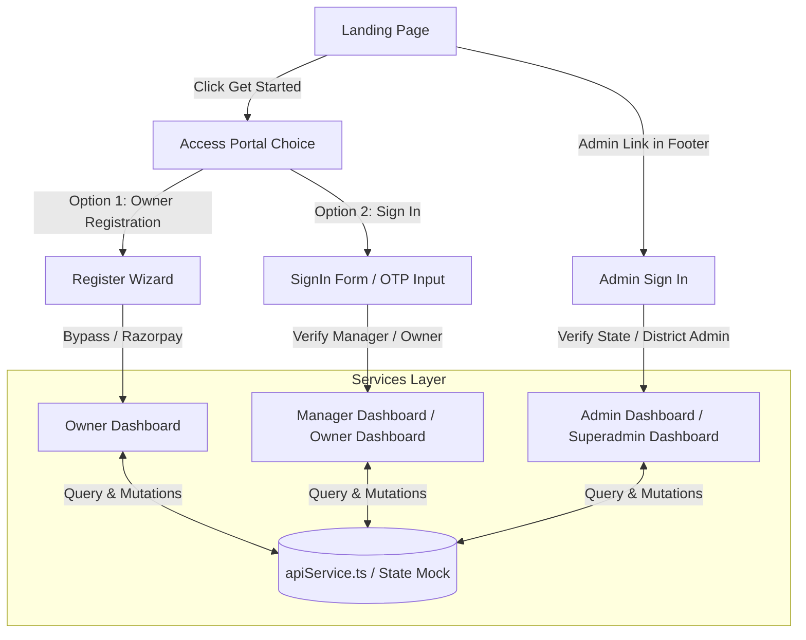

# Pahchaan ID - Developer Navigation Handbook & Guide

Welcome to the **Pahchaan ID** Web Frontend codebase! This guide serves as a navigation handbook to help new developers understand the architecture, folder structure, file responsibilities, state flow, and where to make modifications in under 10–15 minutes.

---

## 🗺️ Application Workflow & Architecture

Below is a simplified conceptual flow showing how the application works:



---

## 📁 Directory & File Index

The application is structured into standard Next.js folders under the `src` directory:

```
src/
├── components/   # Presentational and layout UI Components
│   ├── auth/     # Login, registration, and role choice forms
│   ├── dashboard/# Owner, Manager, Admin panels and views
│   └── landing/  # Landing page sections (Hero, Stats, Footer, etc.)
├── hooks/        # Focused hooks managing page states, timers, and data operations
├── pages/        # Next.js Pages (index.tsx, _app.tsx)
├── services/     # API request wrapper and offline mockup database state
└── styles/       # Tailwind CSS base directives and global configuration
```

---

### 1. 📂 Pages (`src/pages`)

#### 📄 [\_app.tsx](file:///c:/Users/sweet/PehchanID/WebFrontend/src/pages/_app.tsx)
* **Purpose**: Global app wrapper and layout shell.
* **Responsibility**: Manages global layout styling, HTML head metadata for SEO, and the YouTube-style animated page-loading bar.
* **Key Functions/Components**: `App` default export.
* **Related Files**: [globals.css](file:///c:/Users/sweet/PehchanID/WebFrontend/src/styles/globals.css).
* **Line Number**: Core logic begins at `line 17`.

#### 📄 [index.tsx](file:///c:/Users/sweet/PehchanID/WebFrontend/src/pages/index.tsx)
* **Purpose**: Main routing controller and layout renderer.
* **Responsibility**: Invokes the custom state hooks (`useAuth`, `useNavigation`, etc.) and renders the active component based on the navigation state.
* **Key Functions/Components**: `Home` default component.
* **Key State Variables**: Reads active states (`screen`, `role`, etc.) distributed by hooks.
* **Related Files**: Imports components from `src/components` and custom hooks from `src/hooks`.
* **Line Number**: View rendering and routing begins at `line 59`.

---

### 2. 📂 Custom Hooks (`src/hooks`)

These custom React hooks encapsulate all core business logic and state management, keeping pages and UI components clean.

#### 📄 [useNavigation.ts](file:///c:/Users/sweet/PehchanID/WebFrontend/src/hooks/useNavigation.ts)
* **Purpose**: Coordinates screen routing and sub-tabs.
* **Responsibility**: Manages active view switching (e.g. `'landing'`, `'signin'`) and tabs inside dashboard panels.
* **Key Variables/State**: `screen`, `managerTab`, `hotelDetailTab`.
* **Line Number**: Logic starts at `line 21`.

#### 📄 [useAuth.ts](file:///c:/Users/sweet/PehchanID/WebFrontend/src/hooks/useAuth.ts)
* **Purpose**: Authentication controller.
* **Responsibility**: Handles JWT token checks, OTP requests, logins, profile loading, and sign-outs.
* **Key Variables/State**: `role` (`'owner' | 'manager' | 'admin'`), `profile`, `loginPhone`, `loginOtp`.
* **Line Number**: Logic starts at `line 12`.

#### 📄 [useRegistration.ts](file:///c:/Users/sweet/PehchanID/WebFrontend/src/hooks/useRegistration.ts)
* **Purpose**: Registration flow wizard manager.
* **Responsibility**: Drives step-by-step owner registration (personal info, OTP verification, property data, and plan subscription).
* **Key Variables/State**: `regStep`, `regPersonal`, `regHotel`.
* **Line Number**: Logic starts at `line 35`.

#### 📄 [useOwnerDashboard.ts](file:///c:/Users/sweet/PehchanID/WebFrontend/src/hooks/useOwnerDashboard.ts)
* **Purpose**: Coordinates property portfolio state.
* **Responsibility**: Manages the loading of owner-registered hotels, detail tabs, and addition of staff managers.
* **Key Variables/State**: `hotels`, `selectedHotel`, `showAddManagerModal`.
* **Line Number**: Logic starts at `line 23`.

#### 📄 [useManagerDashboard.ts](file:///c:/Users/sweet/PehchanID/WebFrontend/src/hooks/useManagerDashboard.ts)
* **Purpose**: Guest check-in & verification console controller.
* **Responsibility**: Handles ID inputs (Aadhaar, PAN, voter, etc.) and verification submissions for families, couples, students, and professionals.
* **Key Variables/State**: `primaryIdType`, `coupleId1Type`, `proIdType`.
* **Line Number**: Logic starts at `line 16`.

#### 📄 [useAdminDashboard.ts](file:///c:/Users/sweet/PehchanID/WebFrontend/src/hooks/useAdminDashboard.ts)
* **Purpose**: Dashboard controller for government jurisdiction admins.
* **Responsibility**: Simulates real-time guest check-in updates and manages stats breakdowns for states/districts.
* **Key Variables/State**: `adminStats`, `adminRecentHotels`, `adminVerifications`.
* **Line Number**: Logic starts at `line 11`.

---

### 3. 📂 Services (`src/services`)

#### 📄 [apiService.ts](file:///c:/Users/sweet/PehchanID/WebFrontend/src/services/apiService.ts)
* **Purpose**: Network layer and offline mock database fallback.
* **Responsibility**: Coordinates HTTP queries to the backend endpoints (falling back to a stateful localStorage database when offline/in development).
* **Key Functions**: `request()`, `setToken()`, `getToken()`, `mapIdType()`.
* **Line Number**: Mock database states start at `line 78`; API endpoints start at `line 400`.

---

### 4. 📂 Components (`src/components`)

#### 🚪 Authentication Components (`src/components/auth`)
* **[AccessPortalChoice.tsx](file:///c:/Users/sweet/PehchanID/WebFrontend/src/components/auth/AccessPortalChoice.tsx)**: Displays the primary login entry point (Register vs Sign In).
* **[SignInForm.tsx](file:///c:/Users/sweet/PehchanID/WebFrontend/src/components/auth/SignInForm.tsx)**: Phone number and OTP prompt for Owners & Managers.
* **[AdminSignInForm.tsx](file:///c:/Users/sweet/PehchanID/WebFrontend/src/components/auth/AdminSignInForm.tsx)**: Portal credentials form for state/district administrators.
* **[RegisterWizard.tsx](file:///c:/Users/sweet/PehchanID/WebFrontend/src/components/auth/RegisterWizard.tsx)**: Step-by-step multi-page form to register a new hotel.

#### 📊 Dashboard Components (`src/components/dashboard`)
* **[OwnerDashboard.tsx](file:///c:/Users/sweet/PehchanID/WebFrontend/src/components/dashboard/OwnerDashboard.tsx)**: High-level dashboard showcasing the owner's property list, staff counts, and quick actions.
* **[HotelDetail.tsx](file:///c:/Users/sweet/PehchanID/WebFrontend/src/components/dashboard/HotelDetail.tsx)**: Displays full statistics, inspector logs, and employee lists for a specific hotel.
* **[ManagerDashboard.tsx](file:///c:/Users/sweet/PehchanID/WebFrontend/src/components/dashboard/ManagerDashboard.tsx)**: Front-desk guest registration panel supporting multiple verification profiles.
* **[AdminDashboard.tsx](file:///c:/Users/sweet/PehchanID/WebFrontend/src/components/dashboard/AdminDashboard.tsx)**: Government inspectorial portal displaying active hotels, stats, and real-time verification logs.

#### 🌐 Landing Page Components (`src/components/landing`)
* Contains visual static layout files like `LandingHero.tsx`, `LandingNavbar.tsx`, `LandingFooter.tsx`, and `LandingStats.tsx`.

---

## 🛠️ Where to Edit (Cheat Sheet)

| Objective | Target Hook / Component | Key State |
| :--- | :--- | :--- |
| **Change Login or OTP Verification** | [useAuth.ts](file:///c:/Users/sweet/PehchanID/WebFrontend/src/hooks/useAuth.ts) | `loginStep`, `loginPhone` |
| **Modify Guest Registration Fields** | [ManagerDashboard.tsx](file:///c:/Users/sweet/PehchanID/WebFrontend/src/components/dashboard/ManagerDashboard.tsx) | `familyDetails`, `coupleDetails` |
| **Modify Registration Steps** | [RegisterWizard.tsx](file:///c:/Users/sweet/PehchanID/WebFrontend/src/components/auth/RegisterWizard.tsx) | `regStep` |
| **Update Hotel API calls** | [apiService.ts](file:///c:/Users/sweet/PehchanID/WebFrontend/src/services/apiService.ts) | `request()` endpoints |
| **Change Landing Page Hero / Stats** | [LandingHero.tsx](file:///c:/Users/sweet/PehchanID/WebFrontend/src/components/landing/LandingHero.tsx) | *Static UI* |
| **Adjust Government Simulation Speed** | [useAdminDashboard.ts](file:///c:/Users/sweet/PehchanID/WebFrontend/src/hooks/useAdminDashboard.ts) | `setInterval` duration |

---

## 🚀 Quick-Start Guide for Future Developers

1. **Install Dependencies**:
   ```bash
   npm install
   ```
2. **Run in Development Mode**:
   ```bash
   npm run dev
   ```
   Open [http://localhost:3000](http://localhost:3000) in your browser.
3. **Build & Validate**:
   Before submitting code, ensure everything compiles cleanly:
   ```bash
   npm run build
   ```
